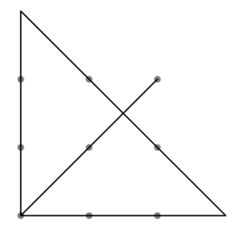
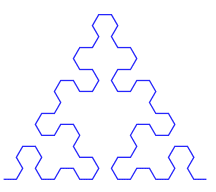

### MyPlot.pm

Currently a Perl PDF library. Eventually this will be a general plotting library with multiple output modules (pdf, eps, windows, ...), like gnuplot.

### MyDef::output_plot

Plot module for MyDef.

### eps

Perl EPS macros.

## Example 1

```
page: test, basic_frame, t.pdf
    $group origin (200, 300), 10pt, gray, u=100
        $(for:i in 0,1,2)
            $(for:j in 0,1,2)
                $draw ($(i)u, $(j)u)
        $line 2, black
        $draw (2u,2u)--(0,0)--(0,3u)--(3u,0)--(0,0)
```

```
$ mydef_page -mplot test.def && perl test.pl
PAGE: test
  --> [./test.pl]
   --> t.pdf

```


Explore output_plot/tests/ for more.

## Example 2 (Sierpinsky)
```
page: sierpinski, basic_frame, t.pdf
    my $str="A"
    my ($x, $y)=(10,10)
    my $step=10

    $for $i=0:4
        $call expand
        # $print $i: [$str]

    $line #2222ff
    $call plot
    MyPlot::stroke()

subcode: expand
    my $s_out=""
    &call each_char, $str
        $if $c eq 'A'
            $s_out.="B-A-B"
        $elif $c eq 'B'
            $s_out.="A+B+A"
        $else
            $s_out.=$c
    $str=$s_out

subcode: plot
    my @stack
    my $dir=0
    MyPlot::moveto($x,$y)
    &call each_char, $str
        $if $c eq 'A' or $c eq 'B'
            $call get_pos
            MyPlot::lineto($x,$y)
        $elif $c eq '+'
            $dir+=60
        $elif $c eq '-'
            $dir-=60

subcode: get_pos
    $x+=cos($dir*3.1415926535/180.0) *$step
    $y+=sin($dir*3.1415926535/180.0) *$step

#---------------------------------------- 
subcode: each_char(s)
    my $n=length($(s))
    $for $i=0:$n
        my $c=substr($(s), $i, 1)
        BLOCK
```


